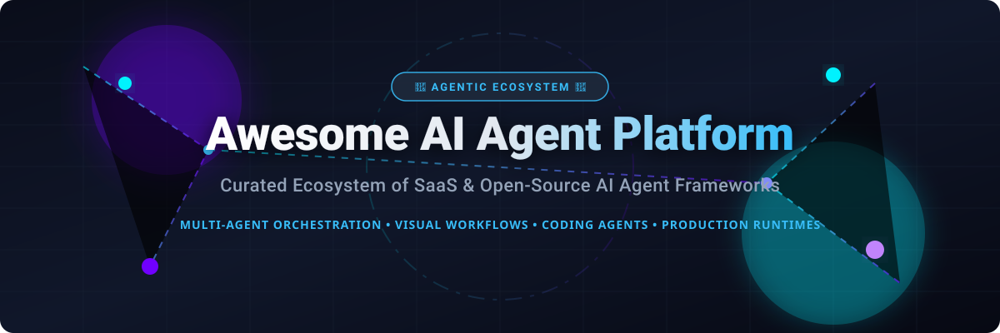

 

# 🤖 Awesome AI Agent Platform Ecosystem

### 🚀 Curated Directory of SaaS Products & Open-Source AI Agent Frameworks
*Focused on Multi-Agent Orchestration, Agent Builders, Visual Workflows, Coding Agents & Production Runtimes*  
**Last updated: September 2026**

---

## 📌 Overview & Introduction

Welcome to **Awesome AI Agent Platform**, the definitive directory tracking top-tier **SaaS platforms** and **open-source GitHub projects** designed for autonomous and semi-autonomous AI agents. 

Whether you are building multi-agent crews, visual drag-and-drop workflow graphs, repository-level coding assistants, or enterprise-grade production runtimes, this resource provides detailed insights into pricing, free tier limits, market valuations, and star metrics.

---

## 📑 Table of Contents
- [📊 Market Analysis & Sector Overview](#-market-analysis--sector-overview)
- [☁️ SaaS / Hosted Platforms](#%EF%B8%8F-saas--hosted-platforms)
- [⚡ Open-Source GitHub Frameworks](#-open-source-github-frameworks)
- [🌟 Key Categories & Framework Highlights](#-key-categories--framework-highlights)
- [🤝 How to Contribute](#-how-to-contribute)
- [⚠️ Disclaimer & Safety Guidelines](#%EF%B8%8F-disclaimer--safety-guidelines)
- [💖 Support & Community](#-support--community)
- [📈 Star History](#-star-history)

---

## 📊 Market Analysis & Sector Overview

> 📈 **Market Insights & Industry Structure**:  
> The global AI Agent Platform market size is estimated at **$7.2 Billion in 2025/2026** and is projected to reach **$47.1 Billion by 2030** (growing at a CAGR of ~42.5%).  
> The sector is currently **highly fragmented**, characterized by fierce competition across specialized niches (multi-agent orchestration, visual workflow canvases, autonomous coding agents, and observability runtimes) rather than a single winner-take-all monopoly. Both open-source frameworks and vendor clouds coexist dynamically.

---

## ☁️ SaaS / Hosted Platforms

Below is a comprehensive comparison of leading hosted commercial AI Agent Platforms, sorted by **Company Size & Valuation (Descending)**.

| 🏢 Platform / Product | 💵 Starting Paid Tier Price | 🎁 Free Tier / Trial Limit | 📊 Company Size & Valuation | 🔗 Description & Core Strengths |
| :--- | :--- | :--- | :--- | :--- |
| **[LangGraph Platform](https://www.langchain.com/langgraph)** | `$39 / seat / month` (Plus Tier) | **Developer Plan**: Free forever (5,000 base traces/mo allowance included) | **$1.25 Billion Valuation** ($260M Total Funding Raised) | Managed stateful runtime for durable, multi-step agentic graphs with deep LangSmith observability & human-in-the-loop controls. |
| **[Dify Cloud](https://dify.ai/)** | `$59 / month` (Professional Plan) | **Sandbox Plan**: Free forever (200 one-time message credits, 50MB knowledge storage, 5 apps) | **$180 Million Valuation** ($30M Series Pre-A in March 2026) | Full-stack agentic workflow platform featuring visual canvas, RAG pipelines, and model management. |
| **[Botpress](https://botpress.com/)** | `$89 / month` (Plus Tier) | **Pay-as-you-go Plan**: Free forever ($5/month recurring AI credit included) | **$120 Million Valuation** ($45M Total Funding Raised) | Enterprise-grade conversational agent builder with visual flow editor, autonomous execution, and hybrid AI engines. |
| **[CrewAI Cloud](https://www.crewai.com/)** | `$200 / month` (Starter Tier) | **Basic Plan**: Free forever (50 workflow executions/month limit) | **$50M–$100M Est. Valuation** ($18M Series A Funding) | Hosted production platform for role-playing multi-agent crews built on top of the open CrewAI orchestration engine. |
| **[Lindy AI](https://www.lindy.ai/)** | `$29.99 / user / month` (Plus Plan) | **Free Trial**: 7-Day Free Trial (Includes 3,000 workspace credits limit) | **$50 Million Est. Valuation** ($49.9M Total Funding Raised) | No-code autonomous AI coworker platform for administrative workflows, email automation, and enterprise tasks. |
| **[SuperAGI Cloud](https://superagi.com/)** | `$25 / month` (Growth Tier) | **Lite Plan**: Free forever (100 AI credits/month limit) | **$25M–$50M Est. Valuation** ($15M Total Funding Raised) | Hosted autonomous agent infrastructure featuring GUI provisioning, agent telemetry, and multi-vector memory. |
| **[OpenHands Cloud](https://www.all-hands.dev/)** | Usage-Based Model Access | **Individual Tier**: Free forever (Daily conversation limit + BYOK model options) | **$25 Million Est. Valuation** ($23.8M Series A Raised by All Hands AI) | Cloud runtime for autonomous software engineering agents that clone, code, edit, and run PRs across repositories. |
| **[AgentOps](https://www.agentops.ai/)** | `$40 / month` (Pro Plan) | **Free Tier**: Free forever (5,000 to 10,000 events/month limit) | **$10M–$20M Est. Valuation** ($2.6M Pre-Seed Funding) | Observability, compliance, cost tracking, and monitoring dashboard built specifically for LLM agent crews. |
| **[Flowise Cloud](https://flowiseai.com/)** | `$35 / month` (Historical Starter Plan) | **Free Tier**: Free forever (2 flow canvases, 100 predictions/month limit) | **Acquired by Workday** (August 2025; Open-source framework active) | Managed drag-and-drop node builder for LangChain agent flows and interactive chatbot APIs. |

---

## ⚡ Open-Source GitHub Frameworks

Open-source innovation dominates the AI agent landscape. Below are the top open-source projects, sorted by **GitHub Star Count (Descending)**.

| 📦 Repository & Project | ⭐ GitHub Stars | 📄 License | 🛠️ Core Focus & Description |
| :--- | :--- | :--- | :--- |
| **[AutoGPT](https://github.com/Significant-Gravitas/AutoGPT)** |  | `MIT` | The pioneering goal-driven autonomous agent framework and suite for building persistent background agents. |
| **[Dify](https://github.com/langgenius/dify)** |  | `Apache-2.0` | Production-ready LLM application & agent development platform with visual workflow canvas, RAG, and agent ops. |
| **[Langflow](https://github.com/langflow-ai/langflow)** |  | `MIT` | Dynamic UI for building multi-agent AI applications, components, vector stores, and custom agent tool chains. |
| **[Browser Use](https://github.com/browser-use/browser-use)** |  | `MIT` | Make web browsers accessible for AI agents—enables autonomous web browsing, form filling, and page interaction. |
| **[OpenHands](https://github.com/All-Hands-AI/OpenHands)** |  | `MIT` | Autonomous software engineering agent capable of reading repos, executing bash commands, fixing bugs, and creating PRs. |
| **[MetaGPT](https://github.com/FoundationAgents/MetaGPT)** |  | `MIT` | Multi-agent framework assigning software company roles (CEO, CTO, Architect, Engineer) to agents for complex coding projects. |
| **[AutoGen](https://github.com/microsoft/autogen)** |  | `MIT` | Microsoft's multi-agent conversation framework enabling agents to converse, solve tasks collaboratively, and call tools. |
| **[CrewAI](https://github.com/crewAIInc/crewAI)** |  | `MIT` | Leading framework for orchestrating role-based, autonomous AI agent crews with sequential and hierarchical processes. |
| **[Flowise](https://github.com/FlowiseAI/Flowise)** |  | `Apache-2.0` | Open-source drag & drop UI node-based builder for LangChain flows, conversational agents, and API endpoints. |
| **[Agno (phidata)](https://github.com/agno-agi/agno)** |  | `MIT` | Lightweight framework for building multimodal agents with memory, structured data outputs, and high-performance runtimes. |
| **[LangGraph](https://github.com/langchain-ai/langgraph)** |  | `MIT` | Low-level framework for building stateful, multi-actor agent workflows with cyclic control, persistence, and human-in-the-loop. |
| **[CAMEL](https://github.com/camel-ai/camel)** |  | `Apache-2.0` | Communicative agents framework exploring autonomous cooperation, role-playing, and communicative behavior research. |
| **[SuperAGI](https://github.com/TransformerOptimus/SuperAGI)** |  | `MIT` | Autonomous AI agent framework with GUI, action telemetry, multiple vector databases, and modular agent tools. |
| **[TaskingAI](https://github.com/TaskingAI/TaskingAI)** |  | `Apache-2.0` | Integrated client-side and server-side framework for building, managing, and hosting LLM agents and tools. |

---

## 🌟 Key Categories & Framework Highlights

* 🤝 **Multi-Agent Orchestration**: **CrewAI** (role-based) and **LangGraph** (graph-based) are the dominant open-source architectural standards.
* 🎨 **Visual & Low-Code Builders**: **Dify**, **Langflow**, and **Flowise** provide drag-and-drop visual canvases for rapid prototyping.
* 💻 **Software Engineering & Coding Agents**: **OpenHands**, **AutoGPT**, and **MetaGPT** lead autonomous codebase editing and execution.
* 🌐 **Web & Browser Autonomous Automation**: **Browser Use** powers AI agents interacting directly with web applications.
* 🔍 **Observability & Guardrails**: **LangSmith / LangGraph Platform** and **AgentOps** provide production monitoring and tracing.

---

## 🤝 How to Contribute

We welcome contributions from the community! Please follow these guidelines:

1. 🍴 **Fork** the repository.
2. 📝 Add or update entries in `README.md`.
3. ℹ️ Include official links, 1–2 sentence factual summary, exact starting price/free tier details, and GitHub star counts.
4. 📥 Submit a **Pull Request** with a clear title and description.

---

## ⚠️ Disclaimer & Safety Guidelines

* 📌 This repository is a **community-curated directory** for informational purposes.
* 🛡️ Autonomous AI agents can perform real-world actions (code execution, network calls, database edits). Always run agents in sandboxed environments with minimum privileges and human-in-the-loop guardrails.

---

## 💖 Support & Community

If you find this list useful, please consider giving it a ⭐ **Star**, **Forking** it, and sharing it with your network!

If you'd like to support my work and open-source contributions, you can buy me a coffee via my [GitHub Sponsors Dashboard](https://github.com/sponsors/ishandutta2007).

---

## 📈 Star History

---

  Made with ❤️ by <a href="https://github.com/ishandutta2007">ishandutta2007</a> and the Open Source Community.

